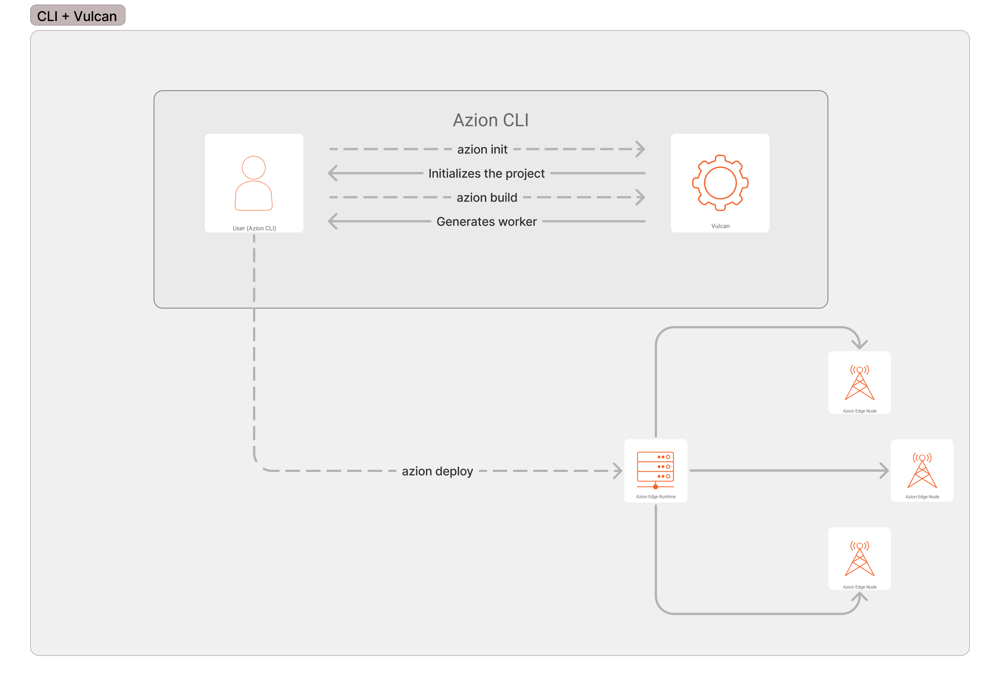

# Atinja o próximo nível na implatação Edge: adotando Polyfills do Node.js (1)
# Faça a implatação no edge sem esforço com Vulcan e Polyfills (2)
# Exeperiência de implatação otimizada no edge

Como desenvolvedores, estamos familiarizados com o mundo acelerado e em constante mudança dos frameworks web. Às vezes, pode ser confuso, pois se destacar no uso de um framework específico requer um entendimento mais profundo que vai além de apenas conhecer a linguagem de programação. Um dos obstáculos significativos é configurar o projeto para funcionar perfeitamente em diferentes ambientes.

Questões como "Isso vai funcionar na nuvem?" e "Em qual plataforma deve ser executado?" surgem frequentemente. Mas e se você pudesse implantar seu projeto no edge, aproveitando a baixa latência, segurança e disponibilidade sem se preocupar com o ambiente específico? Este post explora o conceito de adaptar projetos para serem executados no edge e apresenta uma solução que simplifica o processo.

## Adaptando Projetos para Execução no edge

Para garantir uma implatação contínua, um projeto deve ser estruturado de maneira a evitar atritos com a plataforma hospedeira. Não é incomum encontrar situações em que as configurações necessárias para executar um aplicativo em uma plataforma se parecem muito pouco com as necessárias para uma plataforma diferente. Isso pode levar a um *vendor lock-in*, onde a troca de hosts se torna cara em termos de tempo e dinheiro, forçando os clientes a continuar com o provedor de serviços atual.

Na Azion, valorizamos o poder do software de código aberto e temos como objetivo capacitar o desenvolvimento web moderno. Nossa plataforma permite a inicialização e implatação de projetos em vários frameworks web, incluindo:

- Next.js
- React
- Vue
- Astro
- Angular
- Hexo
- Vite
- JavaScript em si

A Azion fornece seu próprio [Edge Runtime](https://www.azion.com/pt-br/documentacao/devtools/runtime/visao-geral/) projetado para fornecer uma experiência ideal para executar aplicativos no edge. Este runtime alimenta as [Azion Edge Functions](https://www.azion.com/pt-br/documentacao/produtos/guias/edge-functions/primeiros-passos/) e abre um mundo de possibilidades para desenvolvedores e empresas. Além disso, desenvolvemos o [Vulcan](https://github.com/aziontech/vulcan) para preencher as lacunas e permitir que os frameworks web sejam executados nativamente no edge. O Vulcan simplifica a integração de *polyfills* para Edge Computing, revolucionando o processo de criação de workers, especialmente para a plataforma Azion.

> Se você está curioso sobre o que são *polyfills*, são trechos de código usados no JavaScript para fornecer funcionalidades modernas aos ambientes que não oferecem suporte nativo. Os Polyfills preenchem as lacunas, garantindo um comportamento consistente entre diferentes navegadores. Por exemplo, vamos considerar um runtime que não oferece suporte a uma API específica do Node.js, na qual um projeto depende. Durante o processo de build, o Vulcan reconhece a assinatura dessa API e a substitui por uma API relativa, eliminando a necessidade de adaptação manual do projeto.

O Vulcan se destaca na criação de um protocolo intuitivo e simplificado para a criação de *presets*. Este recurso aprimora a personalização e permite que os desenvolvedores adaptem seus aplicativos aos requisitos exclusivos do projeto, fornecendo a flexibilidade necessária para otimizá-los de maneira eficaz.

## Configurando um projeto

A [Azion CLI](https://www.azion.com/pt-br/documentacao/produtos/azion-cli/visao-geral/) é uma ferramenta excepcional que melhora muito a experiência do desenvolvedor. Com a CLI instalada em seu ambiente, inicializar um projeto é tão simples quanto executar o seguinte comando:

```bash
azion init
```

Este comando inicia uma jornada interativa onde você pode escolher o *template* desejado.

Depois de selecionar o *template*, cada framework apresentará um conjunto específico de etapas. Escolha executar o projeto localmente e instale as dependências necessárias.

### Utilizando Polyfills

O Vulcan torna possível o uso de *polyfills*. Vamos dar uma olhada mais de perto em como configurar um projeto para utilizar esse recurso.

**Exemplo**: supondo que você queira iniciar um projeto JavaScript que utiliza a API Buffer do Node.js. Para conseguir isso, você precisa informar ao Vulcan que o projeto implementa polyfills.

O Vulcan lê um arquivo de configuração chamado `vulcan.config.js`. Crie este arquivo e inclua as seguintes propriedades:

```js
module.exports = {
  entry: 'main.js',
  builder: 'webpack',
  useNodePolyfills: true,
};
```

- **entry**: representa o ponto de entrada principal do seu aplicativo, onde o processo de build começa. Não é aplicável para soluções Jamstack.
- **builder**: define a ferramenta de build a ser usada, `esbuild` ou `webpack`.
- **useNodePolyfills**: especifica se os polyfills do Node.js devem ser aplicados.

Depois de aplicar essas configurações, você pode importar as APIs necessárias para o seu projeto. Por exemplo, vamos considerar a importação do Buffer de Node.js:

**Dentro de main.js**:

```js
// Importa a classe Buffer do módulo 'buffer' no Node.js
import { Buffer } from 'node:buffer';

// Define uma função chamada 'myWorker' que leva um evento como argumento
export default function myWorker(event) {
  // Cria uma nova instância de Buffer 'buf1' a partir da string "x"
  var buf1 = Buffer.from("x");
  // Cria uma nova instância de Buffer 'buf2' a partir da string "x"
  var buf2 = Buffer.from("x");
  // Comparando 'buf1' e 'buf2' usando o método Buffer.compare,
  // que retorna um número indicando a igualdade dos buffers
  var a = Buffer.compare(buf1, buf2);

  // O resultado será 0, pois ambos os buffers são iguais
  console.log(a);

  // Agora, vamos trocar os valores de 'buf1' e 'buf2'
  buf1 = Buffer.from("y");
  buf2 = Buffer.from("x");
  // Comparando 'buf1' e 'buf2' novamente
  a = Buffer.compare(buf1, buf2);

  // Aqui, o resultado será 1
  console.log(a);

  // A função retorna um novo objeto Response com a string "Testando polyfills de buffer"
  return new Response("Testando polyfills");
}
```

Para executar o projeto localmente, use o seguinte comando:

```bash 
azion dev
```

Agora você pode acessar o projeto localmente.

> Nota: Certifique-se de estar no diretório raiz do seu projeto para que os comandos sejam executados corretamente.

O comando `azion dev` inicilizar o **processo de buil**, que é gerenciado de maneira transparente pelo Vulcan e retorna a porta para acessar o projeto.

O projeto de exemplo usado neste exemplo pode ser encontrado no repositório [Azion Samples](https://github.com/aziontech/azion-samples/tree/dev/samples/polyfills/buffer) no GitHub.

---

## Edge Runtime, Vulcan e Azion CLI



### Processo explicado 

1. O usuário inicia o processo executando `azion init` via Azion CLI e seleciona o *template* desejado.
2. A Azion CLI, então, invoca o Vulcan, que se encarrega de inicializar o projeto.
3. Vulcan devolve o projeto inicializado ao usuário, que decide se implanta o projeto ou o executa localmente.
4. Se o usuário optar por executar o projeto localmente, Vulcan dispara o processo de build e gera o worker.
5. Se o usuário decidir implantar o projeto, ele executa o comando `azion deploy`. Esse comando inicia o processo de build novamente, após o qual Azion CLI cria uma edge application e a implanta na rede distribuída da Azion.
6. Após a implatação bem-sucedida, a Azion CLI fornece o domínio da application. Depois de um breve período de espera, o aplicativo se torna acessível.

### Responsabilidades 

**CLI Azion**: a interface de linha de comando que serve como principal ponto de interação entre o usuário e o sistema. Gerencia todo o processo de implatação da application, garantindo um fluxo de trabalho eficiente.

**Vulcan**: o motor que impulsiona a inicialização do projeto, build e adaptação. Adequa inteligentemente o projeto com base no *template* selecionado, garantindo que o aplicativo esteja otimamente configurado para o uso pretendido.

**Runtime Edge Azion**: o ambiente de execução que hospeda o aplicativo e gerencia sua execução. A edge applciation é distribuída através da rede global de Edge Nodes, garantindo que ela esteja sempre perto dos usuários, maximizando assim velocidade e eficiência.

---

Ao utilizar a plataforma Azion, os desenvolvedores podem desfrutar de uma melhor experiência de implatação de frameworks web no edge. Adapte seus projetos para serem executados de maneira contínua enquanto se concentra na funcionalidade principal, em vez de se preocupar com o ambiente específico. Com o Edge Runtime da Azion e a ferramenta Vulcan, os desenvolvedores ganham o poder de otimizar seus aplicativos de maneira eficaz, aproveitando a baixa latência, segurança e disponibilidade no edge.
